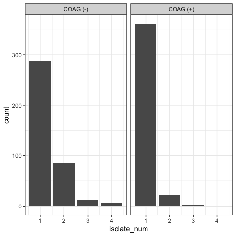

EDA-III
================

``` r
devtools::install_github('chebuu/StaphAureus')
library(StaphAureus)

library(dplyr)
library(ggplot2)
library(kableExtra)
```

#### Cohort COAG(+)/COAG(-)

``` sql
with cpos as (
  select * from microbiologyevents 
  where interpretation is not null 
    and org_name ilike '%STAPH%+%'
),

cneg as (
  select * from microbiologyevents 
  where interpretation is not null 
    and org_name ilike '%STAPH%NEG%'
)

select distinct pt.subject_id from patients pt
left join cneg n on n.subject_id = pt.subject_id
left join cpos p on n.subject_id = p.subject_id
```

``` r
cohort <- bind_rows(
  read.csv(
    system.file('extdata/microbio_coagn.csv', package = 'MIMICMicrobiology')
  ),
  read.csv(
    system.file('extdata/microbio_coagp.csv', package = 'MIMICMicrobiology')
  )
)

cohort.n <- length(unique(cohort$subject_id))

(
  cohort.table <<- cohort %>%
  distinct_at(
    vars(subject_id, org_name, isolate_num)
  ) %>%
  mutate(
    org_name = case_when(
      grepl('NEG', org_name) ~ 'COAG (-)',
      grepl('+', org_name)   ~ 'COAG (+)'
    )
  )
) %>%
ggplot(aes(x=isolate_num)) +
  geom_histogram(stat='count') +
  facet_grid(~org_name) +
  theme_bw() 
```



| subject\_id | org\_name | isolate\_num |
| ----------: | --------: | -----------: |
|         106 |  COAG (-) |            1 |
|         109 |  COAG (-) |            1 |
|          41 |  COAG (-) |            1 |
|         109 |  COAG (-) |            2 |
|         188 |  COAG (-) |            1 |
|         148 |  COAG (-) |            1 |

(N=594)

NOTE: `308 STAPHYLOCOCCUS, COAGULASE NEGATIVE, PRESUMPTIVELY NOT S.
SAPROPHYTICUS`
