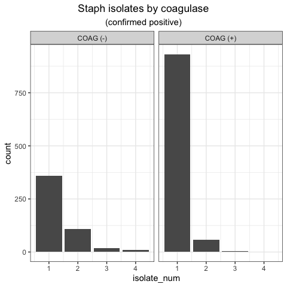

EDA-III
================

``` r
devtools::install_github('chebuu/StaphAureus')
library(StaphAureus)
## Imports:
# library(gt)
# library(grid)
# library(dplyr)
# library(ggplot2)
# library(cowplot)
# library(gridExtra)
# library(kableExtra)
```

#### Cohort COAG(+)/COAG(-)

``` sql
with cpos as (
  select * from microbiologyevents 
  where interpretation is not null 
    and org_name ilike '%STAPH%+%'
),

cneg as (
  select * from microbiologyevents 
  where interpretation is not null 
    and org_name ilike '%STAPH%NEG%'
)

select distinct pt.subject_id from patients pt
left join cneg n on n.subject_id = pt.subject_id
left join cpos p on n.subject_id = pt.subject_id
```

``` sql
create materialized view cohort as
select pt.subject_id, pt.expire_flag, mb.org_name, mb.isolate_num 
from microbiologyevents mb
left join patients pt 
  on mb.subject_id = pt.subject_id
where mb.interpretation is not null 
  and mb.org_name ilike any (
    array [ '%STAPH%+%', '%STAPH%NEG%']
  )
group by pt.subject_id, pt.expire_flag, mb.org_name, mb.isolate_num
```

``` r
data(cohort)

(
  cohort.hist.isolates <<- {
    cohort.iso.table <<- cohort %>%
    distinct_at(
      vars(subject_id, org_name, isolate_num)
    ) %>%
    mutate(
      org_name = case_when(
        grepl('NEG', org_name) ~ 'COAG (-)',
        grepl('+', org_name)   ~ 'COAG (+)'
      )
    )
  } %>% 
  ggplot(aes(x=isolate_num)) +
    geom_histogram(stat='count') +
    facet_grid(~org_name) +
    theme_bw() 
)
```



``` r
(
  cohort.hist.mortality <- {
    cohort.mort.table <<- cohort %>%
    group_by(
      subject_id, org_name, isolate_num, expire_flag
    ) %>%
    mutate(
      org_name = case_when(
        grepl('NEG', org_name) ~ 'COAG (-)',
        grepl('+', org_name)   ~ 'COAG (+)'
      )
    )
  } %>% 
  ggplot(aes(x=isolate_num)) +
    geom_histogram(stat='count') +
    facet_grid(~org_name + expire_flag) +
    theme_bw() 
)
```


``` r
cohort.iso.table -> cohort.table

.displayN <- cohort.table %>% filter(grepl('-', org_name)) 
gt(.displayN %>% head(6)) %>%
  fmt_number(columns = vars(isolate_num), decimals = 0) %>%
  fmt_passthrough(columns = vars(subject_id, org_name)) %>%
  tab_header(
    title = md(''),
    subtitle = sprintf('(N=%s)', nrow(.displayN))
  ) %>%
  tab_source_note(md(''))
```

<!--html_preserve-->

<div id="tjixdnygsg" style="overflow-x:auto;overflow-y:auto;width:auto;height:auto;">

<table class="gt_table">

<thead class="gt_header">

<tr>

<th colspan="3" class="gt_heading gt_title gt_font_normal" style>

</th>

</tr>

<tr>

<th colspan="3" class="gt_heading gt_subtitle gt_font_normal gt_bottom_border" style>

(N=1588)

</th>

</tr>

</thead>

<thead class="gt_col_headings">

<tr>

<th class="gt_col_heading gt_columns_bottom_border gt_center" rowspan="1" colspan="1">

subject\_id

</th>

<th class="gt_col_heading gt_columns_bottom_border gt_left" rowspan="1" colspan="1">

org\_name

</th>

<th class="gt_col_heading gt_columns_bottom_border gt_center" rowspan="1" colspan="1">

isolate\_num

</th>

</tr>

</thead>

<tbody class="gt_table_body">

<tr>

<td class="gt_row gt_center">

28805

</td>

<td class="gt_row gt_left">

COAG (-)

</td>

<td class="gt_row gt_center">

1

</td>

</tr>

<tr>

<td class="gt_row gt_center">

4430

</td>

<td class="gt_row gt_left">

COAG (-)

</td>

<td class="gt_row gt_center">

1

</td>

</tr>

<tr>

<td class="gt_row gt_center">

17125

</td>

<td class="gt_row gt_left">

COAG (-)

</td>

<td class="gt_row gt_center">

2

</td>

</tr>

<tr>

<td class="gt_row gt_center">

353

</td>

<td class="gt_row gt_left">

COAG (-)

</td>

<td class="gt_row gt_center">

4

</td>

</tr>

<tr>

<td class="gt_row gt_center">

18350

</td>

<td class="gt_row gt_left">

COAG (-)

</td>

<td class="gt_row gt_center">

1

</td>

</tr>

<tr>

<td class="gt_row gt_center">

11024

</td>

<td class="gt_row gt_left">

COAG (-)

</td>

<td class="gt_row gt_center">

1

</td>

</tr>

</tbody>

<tfoot class="gt_sourcenotes">

<tr>

<td class="gt_sourcenote" colspan="3">

</td>

</tr>

</tfoot>

</table>

</div>

<!--/html_preserve-->

``` r

.displayP <- cohort.table %>% filter(grepl('\\+', org_name))
gt(.displayP %>% head(6)) %>%
  fmt_number(columns = vars(isolate_num), decimals = 0) %>%
  fmt_passthrough(columns = vars(subject_id, org_name)) %>%
  tab_header(
    title = md(''),
    subtitle = sprintf('(N=%s)', nrow(.displayP))
  ) %>%
  tab_source_note(md(''))
```

<!--html_preserve-->

<div id="siqtswetuu" style="overflow-x:auto;overflow-y:auto;width:auto;height:auto;">

<table class="gt_table">

<thead class="gt_header">

<tr>

<th colspan="3" class="gt_heading gt_title gt_font_normal" style>

</th>

</tr>

<tr>

<th colspan="3" class="gt_heading gt_subtitle gt_font_normal gt_bottom_border" style>

(N=3411)

</th>

</tr>

</thead>

<thead class="gt_col_headings">

<tr>

<th class="gt_col_heading gt_columns_bottom_border gt_center" rowspan="1" colspan="1">

subject\_id

</th>

<th class="gt_col_heading gt_columns_bottom_border gt_left" rowspan="1" colspan="1">

org\_name

</th>

<th class="gt_col_heading gt_columns_bottom_border gt_center" rowspan="1" colspan="1">

isolate\_num

</th>

</tr>

</thead>

<tbody class="gt_table_body">

<tr>

<td class="gt_row gt_center">

2624

</td>

<td class="gt_row gt_left">

COAG (+)

</td>

<td class="gt_row gt_center">

1

</td>

</tr>

<tr>

<td class="gt_row gt_center">

11785

</td>

<td class="gt_row gt_left">

COAG (+)

</td>

<td class="gt_row gt_center">

1

</td>

</tr>

<tr>

<td class="gt_row gt_center">

29337

</td>

<td class="gt_row gt_left">

COAG (+)

</td>

<td class="gt_row gt_center">

1

</td>

</tr>

<tr>

<td class="gt_row gt_center">

21162

</td>

<td class="gt_row gt_left">

COAG (+)

</td>

<td class="gt_row gt_center">

1

</td>

</tr>

<tr>

<td class="gt_row gt_center">

19199

</td>

<td class="gt_row gt_left">

COAG (+)

</td>

<td class="gt_row gt_center">

1

</td>

</tr>

<tr>

<td class="gt_row gt_center">

65999

</td>

<td class="gt_row gt_left">

COAG (+)

</td>

<td class="gt_row gt_center">

1

</td>

</tr>

</tbody>

<tfoot class="gt_sourcenotes">

<tr>

<td class="gt_sourcenote" colspan="3">

</td>

</tr>

</tfoot>

</table>

</div>

<!--/html_preserve-->

NOTE: `308 STAPHYLOCOCCUS, COAGULASE NEGATIVE, PRESUMPTIVELY NOT S.
SAPROPHYTICUS`

Interpretation levels: - “P” - “S” - “R” - “I” - “None”

NOTE: All the MRSA screens (and a few other `itemid`s) have null values.

`222577 16839 168517 "2102-09-06 00:00:00" "2102-09-06 09:49:00" 70091
"MRSA SCREEN" 80023 "STAPH AUREUS COAG +" 1 90016 "OXACILLIN" "R"`

``` sql
with cpos as (
  select * from microbiologyevents 
  where interpretation is not null 
    and org_name ilike '%STAPH%+%'
),

cneg as (
  select * from microbiologyevents 
  where interpretation is not null 
    and org_name ilike '%STAPH%NEG%'
)

select distinct on (dxm.subject_id) dxm.* from microbiologyevents dxm
right join cneg n on n.subject_id = dxm.subject_id
right join cpos p on n.subject_id = dxm.subject_id
```
