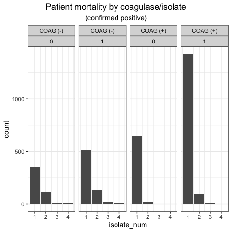

EDA-III
================

``` r
devtools::install_github('chebuu/StaphAureus')
library(StaphAureus)
## Imports:
# library(gt)
# library(grid)
# library(dplyr)
# library(ggplot2)
# library(cowplot)
# library(gridExtra)
# library(kableExtra)
```

#### Cohort COAG(+)/COAG(-)

``` sql
with cpos as (
  select * from microbiologyevents 
  where interpretation is not null 
    and org_name ilike '%STAPH%+%'
),

cneg as (
  select * from microbiologyevents 
  where interpretation is not null 
    and org_name ilike '%STAPH%NEG%'
)

select distinct pt.subject_id from patients pt
left join cneg n on n.subject_id = pt.subject_id
left join cpos p on n.subject_id = pt.subject_id
```

``` sql
create materialized view cohort as
select pt.subject_id, pt.expire_flag, mb.org_name, mb.isolate_num 
from microbiologyevents mb
left join patients pt 
  on mb.subject_id = pt.subject_id
where mb.interpretation is not null 
  and mb.org_name ilike any (
    array [ '%STAPH%+%', '%STAPH%NEG%']
  )
group by pt.subject_id, pt.expire_flag, mb.org_name, mb.isolate_num
```

``` r
data(cohort)

cohort.N <<- length(unique(cohort$subject_id))

(
  cohort.hist.isolates <<- {
    cohort.iso.table <<- cohort %>%
    distinct_at(
      vars(subject_id, org_name, isolate_num)
    ) %>%
    mutate(
      org_name = case_when(
        grepl('NEG', org_name) ~ 'COAG (-)',
        grepl('+', org_name)   ~ 'COAG (+)'
      )
    )
  } %>% 
  ggplot(aes(x=isolate_num)) +
    geom_histogram(stat='count') +
    facet_grid(~org_name) +
    theme_bw() 
)
```


``` r
(
  cohort.hist.mortality <- {
    cohort.mort.table <<- cohort %>%
    distinct_at(
      vars(subject_id, org_name, isolate_num)
    ) %>%
    mutate(
      org_name = case_when(
        grepl('NEG', org_name) ~ 'COAG (-)',
        grepl('+', org_name)   ~ 'COAG (+)'
      )
    )
  } %>% 
  ggplot(aes(x=isolate_num)) +
    geom_histogram(stat='count') +
    facet_grid(~org_name) +
    theme_bw() 
)
```



<!--html_preserve-->

<style>html {
  font-family: -apple-system, BlinkMacSystemFont, 'Segoe UI', Roboto, Oxygen, Ubuntu, Cantarell, 'Helvetica Neue', 'Fira Sans', 'Droid Sans', Arial, sans-serif;
}

#dirreyxshj .gt_table {
  display: table;
  border-collapse: collapse;
  margin-left: auto;
  margin-right: auto;
  color: #333333;
  font-size: 16px;
  font-weight: normal;
  font-style: normal;
  background-color: #FFFFFF;
  width: auto;
  border-top-style: solid;
  border-top-width: 2px;
  border-top-color: #A8A8A8;
  border-right-style: none;
  border-right-width: 2px;
  border-right-color: #D3D3D3;
  border-bottom-style: solid;
  border-bottom-width: 2px;
  border-bottom-color: #A8A8A8;
  border-left-style: none;
  border-left-width: 2px;
  border-left-color: #D3D3D3;
}

#dirreyxshj .gt_heading {
  background-color: #FFFFFF;
  text-align: center;
  border-bottom-color: #FFFFFF;
  border-left-style: none;
  border-left-width: 1px;
  border-left-color: #D3D3D3;
  border-right-style: none;
  border-right-width: 1px;
  border-right-color: #D3D3D3;
}

#dirreyxshj .gt_title {
  color: #333333;
  font-size: 125%;
  font-weight: initial;
  padding-top: 4px;
  padding-bottom: 4px;
  border-bottom-color: #FFFFFF;
  border-bottom-width: 0;
}

#dirreyxshj .gt_subtitle {
  color: #333333;
  font-size: 85%;
  font-weight: initial;
  padding-top: 0;
  padding-bottom: 4px;
  border-top-color: #FFFFFF;
  border-top-width: 0;
}

#dirreyxshj .gt_bottom_border {
  border-bottom-style: solid;
  border-bottom-width: 2px;
  border-bottom-color: #D3D3D3;
}

#dirreyxshj .gt_col_headings {
  border-top-style: solid;
  border-top-width: 2px;
  border-top-color: #D3D3D3;
  border-bottom-style: solid;
  border-bottom-width: 2px;
  border-bottom-color: #D3D3D3;
  border-left-style: none;
  border-left-width: 1px;
  border-left-color: #D3D3D3;
  border-right-style: none;
  border-right-width: 1px;
  border-right-color: #D3D3D3;
}

#dirreyxshj .gt_col_heading {
  color: #333333;
  background-color: #FFFFFF;
  font-size: 100%;
  font-weight: normal;
  text-transform: inherit;
  border-left-style: none;
  border-left-width: 1px;
  border-left-color: #D3D3D3;
  border-right-style: none;
  border-right-width: 1px;
  border-right-color: #D3D3D3;
  vertical-align: bottom;
  padding-top: 5px;
  padding-bottom: 6px;
  padding-left: 5px;
  padding-right: 5px;
  overflow-x: hidden;
}

#dirreyxshj .gt_column_spanner_outer {
  color: #333333;
  background-color: #FFFFFF;
  font-size: 100%;
  font-weight: normal;
  text-transform: inherit;
  padding-top: 0;
  padding-bottom: 0;
  padding-left: 4px;
  padding-right: 4px;
}

#dirreyxshj .gt_column_spanner_outer:first-child {
  padding-left: 0;
}

#dirreyxshj .gt_column_spanner_outer:last-child {
  padding-right: 0;
}

#dirreyxshj .gt_column_spanner {
  border-bottom-style: solid;
  border-bottom-width: 2px;
  border-bottom-color: #D3D3D3;
  vertical-align: bottom;
  padding-top: 5px;
  padding-bottom: 6px;
  overflow-x: hidden;
  display: inline-block;
  width: 100%;
}

#dirreyxshj .gt_group_heading {
  padding: 8px;
  color: #333333;
  background-color: #FFFFFF;
  font-size: 100%;
  font-weight: initial;
  text-transform: inherit;
  border-top-style: solid;
  border-top-width: 2px;
  border-top-color: #D3D3D3;
  border-bottom-style: solid;
  border-bottom-width: 2px;
  border-bottom-color: #D3D3D3;
  border-left-style: none;
  border-left-width: 1px;
  border-left-color: #D3D3D3;
  border-right-style: none;
  border-right-width: 1px;
  border-right-color: #D3D3D3;
  vertical-align: middle;
}

#dirreyxshj .gt_empty_group_heading {
  padding: 0.5px;
  color: #333333;
  background-color: #FFFFFF;
  font-size: 100%;
  font-weight: initial;
  border-top-style: solid;
  border-top-width: 2px;
  border-top-color: #D3D3D3;
  border-bottom-style: solid;
  border-bottom-width: 2px;
  border-bottom-color: #D3D3D3;
  vertical-align: middle;
}

#dirreyxshj .gt_from_md > :first-child {
  margin-top: 0;
}

#dirreyxshj .gt_from_md > :last-child {
  margin-bottom: 0;
}

#dirreyxshj .gt_row {
  padding-top: 8px;
  padding-bottom: 8px;
  padding-left: 5px;
  padding-right: 5px;
  margin: 10px;
  border-top-style: solid;
  border-top-width: 1px;
  border-top-color: #D3D3D3;
  border-left-style: none;
  border-left-width: 1px;
  border-left-color: #D3D3D3;
  border-right-style: none;
  border-right-width: 1px;
  border-right-color: #D3D3D3;
  vertical-align: middle;
  overflow-x: hidden;
}

#dirreyxshj .gt_stub {
  color: #333333;
  background-color: #FFFFFF;
  font-size: 100%;
  font-weight: initial;
  text-transform: inherit;
  border-right-style: solid;
  border-right-width: 2px;
  border-right-color: #D3D3D3;
  padding-left: 12px;
}

#dirreyxshj .gt_summary_row {
  color: #333333;
  background-color: #FFFFFF;
  text-transform: inherit;
  padding-top: 8px;
  padding-bottom: 8px;
  padding-left: 5px;
  padding-right: 5px;
}

#dirreyxshj .gt_first_summary_row {
  padding-top: 8px;
  padding-bottom: 8px;
  padding-left: 5px;
  padding-right: 5px;
  border-top-style: solid;
  border-top-width: 2px;
  border-top-color: #D3D3D3;
}

#dirreyxshj .gt_grand_summary_row {
  color: #333333;
  background-color: #FFFFFF;
  text-transform: inherit;
  padding-top: 8px;
  padding-bottom: 8px;
  padding-left: 5px;
  padding-right: 5px;
}

#dirreyxshj .gt_first_grand_summary_row {
  padding-top: 8px;
  padding-bottom: 8px;
  padding-left: 5px;
  padding-right: 5px;
  border-top-style: double;
  border-top-width: 6px;
  border-top-color: #D3D3D3;
}

#dirreyxshj .gt_striped {
  background-color: rgba(128, 128, 128, 0.05);
}

#dirreyxshj .gt_table_body {
  border-top-style: solid;
  border-top-width: 2px;
  border-top-color: #D3D3D3;
  border-bottom-style: solid;
  border-bottom-width: 2px;
  border-bottom-color: #D3D3D3;
}

#dirreyxshj .gt_footnotes {
  color: #333333;
  background-color: #FFFFFF;
  border-bottom-style: none;
  border-bottom-width: 2px;
  border-bottom-color: #D3D3D3;
  border-left-style: none;
  border-left-width: 2px;
  border-left-color: #D3D3D3;
  border-right-style: none;
  border-right-width: 2px;
  border-right-color: #D3D3D3;
}

#dirreyxshj .gt_footnote {
  margin: 0px;
  font-size: 90%;
  padding: 4px;
}

#dirreyxshj .gt_sourcenotes {
  color: #333333;
  background-color: #FFFFFF;
  border-bottom-style: none;
  border-bottom-width: 2px;
  border-bottom-color: #D3D3D3;
  border-left-style: none;
  border-left-width: 2px;
  border-left-color: #D3D3D3;
  border-right-style: none;
  border-right-width: 2px;
  border-right-color: #D3D3D3;
}

#dirreyxshj .gt_sourcenote {
  font-size: 90%;
  padding: 4px;
}

#dirreyxshj .gt_left {
  text-align: left;
}

#dirreyxshj .gt_center {
  text-align: center;
}

#dirreyxshj .gt_right {
  text-align: right;
  font-variant-numeric: tabular-nums;
}

#dirreyxshj .gt_font_normal {
  font-weight: normal;
}

#dirreyxshj .gt_font_bold {
  font-weight: bold;
}

#dirreyxshj .gt_font_italic {
  font-style: italic;
}

#dirreyxshj .gt_super {
  font-size: 65%;
}

#dirreyxshj .gt_footnote_marks {
  font-style: italic;
  font-size: 65%;
}
</style>

<div id="dirreyxshj" style="overflow-x:auto;overflow-y:auto;width:auto;height:auto;">

<table class="gt_table">

<thead class="gt_header">

<tr>

<th colspan="3" class="gt_heading gt_title gt_font_normal" style>

</th>

</tr>

<tr>

<th colspan="3" class="gt_heading gt_subtitle gt_font_normal gt_bottom_border" style>

(N=1588)

</th>

</tr>

</thead>

<thead class="gt_col_headings">

<tr>

<th class="gt_col_heading gt_columns_bottom_border gt_center" rowspan="1" colspan="1">

subject\_id

</th>

<th class="gt_col_heading gt_columns_bottom_border gt_left" rowspan="1" colspan="1">

org\_name

</th>

<th class="gt_col_heading gt_columns_bottom_border gt_center" rowspan="1" colspan="1">

isolate\_num

</th>

</tr>

</thead>

<tbody class="gt_table_body">

<tr>

<td class="gt_row gt_center">

28805

</td>

<td class="gt_row gt_left">

COAG (-)

</td>

<td class="gt_row gt_center">

1

</td>

</tr>

<tr>

<td class="gt_row gt_center">

4430

</td>

<td class="gt_row gt_left">

COAG (-)

</td>

<td class="gt_row gt_center">

1

</td>

</tr>

<tr>

<td class="gt_row gt_center">

17125

</td>

<td class="gt_row gt_left">

COAG (-)

</td>

<td class="gt_row gt_center">

2

</td>

</tr>

<tr>

<td class="gt_row gt_center">

353

</td>

<td class="gt_row gt_left">

COAG (-)

</td>

<td class="gt_row gt_center">

4

</td>

</tr>

<tr>

<td class="gt_row gt_center">

18350

</td>

<td class="gt_row gt_left">

COAG (-)

</td>

<td class="gt_row gt_center">

1

</td>

</tr>

<tr>

<td class="gt_row gt_center">

11024

</td>

<td class="gt_row gt_left">

COAG (-)

</td>

<td class="gt_row gt_center">

1

</td>

</tr>

</tbody>

<tfoot class="gt_sourcenotes">

<tr>

<td class="gt_sourcenote" colspan="3">

</td>

</tr>

</tfoot>

</table>

</div>

<!--/html_preserve-->

<!--html_preserve-->

<style>html {
  font-family: -apple-system, BlinkMacSystemFont, 'Segoe UI', Roboto, Oxygen, Ubuntu, Cantarell, 'Helvetica Neue', 'Fira Sans', 'Droid Sans', Arial, sans-serif;
}

#kskxfkegxq .gt_table {
  display: table;
  border-collapse: collapse;
  margin-left: auto;
  margin-right: auto;
  color: #333333;
  font-size: 16px;
  font-weight: normal;
  font-style: normal;
  background-color: #FFFFFF;
  width: auto;
  border-top-style: solid;
  border-top-width: 2px;
  border-top-color: #A8A8A8;
  border-right-style: none;
  border-right-width: 2px;
  border-right-color: #D3D3D3;
  border-bottom-style: solid;
  border-bottom-width: 2px;
  border-bottom-color: #A8A8A8;
  border-left-style: none;
  border-left-width: 2px;
  border-left-color: #D3D3D3;
}

#kskxfkegxq .gt_heading {
  background-color: #FFFFFF;
  text-align: center;
  border-bottom-color: #FFFFFF;
  border-left-style: none;
  border-left-width: 1px;
  border-left-color: #D3D3D3;
  border-right-style: none;
  border-right-width: 1px;
  border-right-color: #D3D3D3;
}

#kskxfkegxq .gt_title {
  color: #333333;
  font-size: 125%;
  font-weight: initial;
  padding-top: 4px;
  padding-bottom: 4px;
  border-bottom-color: #FFFFFF;
  border-bottom-width: 0;
}

#kskxfkegxq .gt_subtitle {
  color: #333333;
  font-size: 85%;
  font-weight: initial;
  padding-top: 0;
  padding-bottom: 4px;
  border-top-color: #FFFFFF;
  border-top-width: 0;
}

#kskxfkegxq .gt_bottom_border {
  border-bottom-style: solid;
  border-bottom-width: 2px;
  border-bottom-color: #D3D3D3;
}

#kskxfkegxq .gt_col_headings {
  border-top-style: solid;
  border-top-width: 2px;
  border-top-color: #D3D3D3;
  border-bottom-style: solid;
  border-bottom-width: 2px;
  border-bottom-color: #D3D3D3;
  border-left-style: none;
  border-left-width: 1px;
  border-left-color: #D3D3D3;
  border-right-style: none;
  border-right-width: 1px;
  border-right-color: #D3D3D3;
}

#kskxfkegxq .gt_col_heading {
  color: #333333;
  background-color: #FFFFFF;
  font-size: 100%;
  font-weight: normal;
  text-transform: inherit;
  border-left-style: none;
  border-left-width: 1px;
  border-left-color: #D3D3D3;
  border-right-style: none;
  border-right-width: 1px;
  border-right-color: #D3D3D3;
  vertical-align: bottom;
  padding-top: 5px;
  padding-bottom: 6px;
  padding-left: 5px;
  padding-right: 5px;
  overflow-x: hidden;
}

#kskxfkegxq .gt_column_spanner_outer {
  color: #333333;
  background-color: #FFFFFF;
  font-size: 100%;
  font-weight: normal;
  text-transform: inherit;
  padding-top: 0;
  padding-bottom: 0;
  padding-left: 4px;
  padding-right: 4px;
}

#kskxfkegxq .gt_column_spanner_outer:first-child {
  padding-left: 0;
}

#kskxfkegxq .gt_column_spanner_outer:last-child {
  padding-right: 0;
}

#kskxfkegxq .gt_column_spanner {
  border-bottom-style: solid;
  border-bottom-width: 2px;
  border-bottom-color: #D3D3D3;
  vertical-align: bottom;
  padding-top: 5px;
  padding-bottom: 6px;
  overflow-x: hidden;
  display: inline-block;
  width: 100%;
}

#kskxfkegxq .gt_group_heading {
  padding: 8px;
  color: #333333;
  background-color: #FFFFFF;
  font-size: 100%;
  font-weight: initial;
  text-transform: inherit;
  border-top-style: solid;
  border-top-width: 2px;
  border-top-color: #D3D3D3;
  border-bottom-style: solid;
  border-bottom-width: 2px;
  border-bottom-color: #D3D3D3;
  border-left-style: none;
  border-left-width: 1px;
  border-left-color: #D3D3D3;
  border-right-style: none;
  border-right-width: 1px;
  border-right-color: #D3D3D3;
  vertical-align: middle;
}

#kskxfkegxq .gt_empty_group_heading {
  padding: 0.5px;
  color: #333333;
  background-color: #FFFFFF;
  font-size: 100%;
  font-weight: initial;
  border-top-style: solid;
  border-top-width: 2px;
  border-top-color: #D3D3D3;
  border-bottom-style: solid;
  border-bottom-width: 2px;
  border-bottom-color: #D3D3D3;
  vertical-align: middle;
}

#kskxfkegxq .gt_from_md > :first-child {
  margin-top: 0;
}

#kskxfkegxq .gt_from_md > :last-child {
  margin-bottom: 0;
}

#kskxfkegxq .gt_row {
  padding-top: 8px;
  padding-bottom: 8px;
  padding-left: 5px;
  padding-right: 5px;
  margin: 10px;
  border-top-style: solid;
  border-top-width: 1px;
  border-top-color: #D3D3D3;
  border-left-style: none;
  border-left-width: 1px;
  border-left-color: #D3D3D3;
  border-right-style: none;
  border-right-width: 1px;
  border-right-color: #D3D3D3;
  vertical-align: middle;
  overflow-x: hidden;
}

#kskxfkegxq .gt_stub {
  color: #333333;
  background-color: #FFFFFF;
  font-size: 100%;
  font-weight: initial;
  text-transform: inherit;
  border-right-style: solid;
  border-right-width: 2px;
  border-right-color: #D3D3D3;
  padding-left: 12px;
}

#kskxfkegxq .gt_summary_row {
  color: #333333;
  background-color: #FFFFFF;
  text-transform: inherit;
  padding-top: 8px;
  padding-bottom: 8px;
  padding-left: 5px;
  padding-right: 5px;
}

#kskxfkegxq .gt_first_summary_row {
  padding-top: 8px;
  padding-bottom: 8px;
  padding-left: 5px;
  padding-right: 5px;
  border-top-style: solid;
  border-top-width: 2px;
  border-top-color: #D3D3D3;
}

#kskxfkegxq .gt_grand_summary_row {
  color: #333333;
  background-color: #FFFFFF;
  text-transform: inherit;
  padding-top: 8px;
  padding-bottom: 8px;
  padding-left: 5px;
  padding-right: 5px;
}

#kskxfkegxq .gt_first_grand_summary_row {
  padding-top: 8px;
  padding-bottom: 8px;
  padding-left: 5px;
  padding-right: 5px;
  border-top-style: double;
  border-top-width: 6px;
  border-top-color: #D3D3D3;
}

#kskxfkegxq .gt_striped {
  background-color: rgba(128, 128, 128, 0.05);
}

#kskxfkegxq .gt_table_body {
  border-top-style: solid;
  border-top-width: 2px;
  border-top-color: #D3D3D3;
  border-bottom-style: solid;
  border-bottom-width: 2px;
  border-bottom-color: #D3D3D3;
}

#kskxfkegxq .gt_footnotes {
  color: #333333;
  background-color: #FFFFFF;
  border-bottom-style: none;
  border-bottom-width: 2px;
  border-bottom-color: #D3D3D3;
  border-left-style: none;
  border-left-width: 2px;
  border-left-color: #D3D3D3;
  border-right-style: none;
  border-right-width: 2px;
  border-right-color: #D3D3D3;
}

#kskxfkegxq .gt_footnote {
  margin: 0px;
  font-size: 90%;
  padding: 4px;
}

#kskxfkegxq .gt_sourcenotes {
  color: #333333;
  background-color: #FFFFFF;
  border-bottom-style: none;
  border-bottom-width: 2px;
  border-bottom-color: #D3D3D3;
  border-left-style: none;
  border-left-width: 2px;
  border-left-color: #D3D3D3;
  border-right-style: none;
  border-right-width: 2px;
  border-right-color: #D3D3D3;
}

#kskxfkegxq .gt_sourcenote {
  font-size: 90%;
  padding: 4px;
}

#kskxfkegxq .gt_left {
  text-align: left;
}

#kskxfkegxq .gt_center {
  text-align: center;
}

#kskxfkegxq .gt_right {
  text-align: right;
  font-variant-numeric: tabular-nums;
}

#kskxfkegxq .gt_font_normal {
  font-weight: normal;
}

#kskxfkegxq .gt_font_bold {
  font-weight: bold;
}

#kskxfkegxq .gt_font_italic {
  font-style: italic;
}

#kskxfkegxq .gt_super {
  font-size: 65%;
}

#kskxfkegxq .gt_footnote_marks {
  font-style: italic;
  font-size: 65%;
}
</style>

<div id="kskxfkegxq" style="overflow-x:auto;overflow-y:auto;width:auto;height:auto;">

<table class="gt_table">

<thead class="gt_header">

<tr>

<th colspan="3" class="gt_heading gt_title gt_font_normal" style>

</th>

</tr>

<tr>

<th colspan="3" class="gt_heading gt_subtitle gt_font_normal gt_bottom_border" style>

(N=4999)

</th>

</tr>

</thead>

<thead class="gt_col_headings">

<tr>

<th class="gt_col_heading gt_columns_bottom_border gt_center" rowspan="1" colspan="1">

subject\_id

</th>

<th class="gt_col_heading gt_columns_bottom_border gt_left" rowspan="1" colspan="1">

org\_name

</th>

<th class="gt_col_heading gt_columns_bottom_border gt_center" rowspan="1" colspan="1">

isolate\_num

</th>

</tr>

</thead>

<tbody class="gt_table_body">

<tr>

<td class="gt_row gt_center">

2624

</td>

<td class="gt_row gt_left">

COAG (+)

</td>

<td class="gt_row gt_center">

1

</td>

</tr>

<tr>

<td class="gt_row gt_center">

11785

</td>

<td class="gt_row gt_left">

COAG (+)

</td>

<td class="gt_row gt_center">

1

</td>

</tr>

<tr>

<td class="gt_row gt_center">

28805

</td>

<td class="gt_row gt_left">

COAG (-)

</td>

<td class="gt_row gt_center">

1

</td>

</tr>

<tr>

<td class="gt_row gt_center">

29337

</td>

<td class="gt_row gt_left">

COAG (+)

</td>

<td class="gt_row gt_center">

1

</td>

</tr>

<tr>

<td class="gt_row gt_center">

21162

</td>

<td class="gt_row gt_left">

COAG (+)

</td>

<td class="gt_row gt_center">

1

</td>

</tr>

<tr>

<td class="gt_row gt_center">

4430

</td>

<td class="gt_row gt_left">

COAG (-)

</td>

<td class="gt_row gt_center">

1

</td>

</tr>

</tbody>

<tfoot class="gt_sourcenotes">

<tr>

<td class="gt_sourcenote" colspan="3">

</td>

</tr>

</tfoot>

</table>

</div>

<!--/html_preserve-->

NOTE: `308 STAPHYLOCOCCUS, COAGULASE NEGATIVE, PRESUMPTIVELY NOT S.
SAPROPHYTICUS`

Interpretation levels: - “P” - “S” - “R” - “I” - “None”

NOTE: All the MRSA screens (and a few other `itemid`s) have null values.

`222577 16839 168517 "2102-09-06 00:00:00" "2102-09-06 09:49:00" 70091
"MRSA SCREEN" 80023 "STAPH AUREUS COAG +" 1 90016 "OXACILLIN" "R"`

``` sql
with cpos as (
  select * from microbiologyevents 
  where interpretation is not null 
    and org_name ilike '%STAPH%+%'
),

cneg as (
  select * from microbiologyevents 
  where interpretation is not null 
    and org_name ilike '%STAPH%NEG%'
)

select distinct on (dxm.subject_id) dxm.* from microbiologyevents dxm
right join cneg n on n.subject_id = dxm.subject_id
right join cpos p on n.subject_id = dxm.subject_id
```
